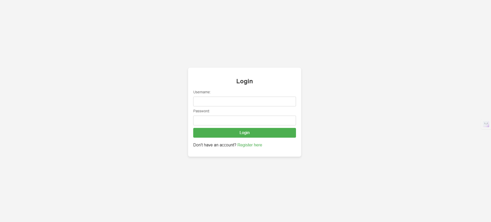
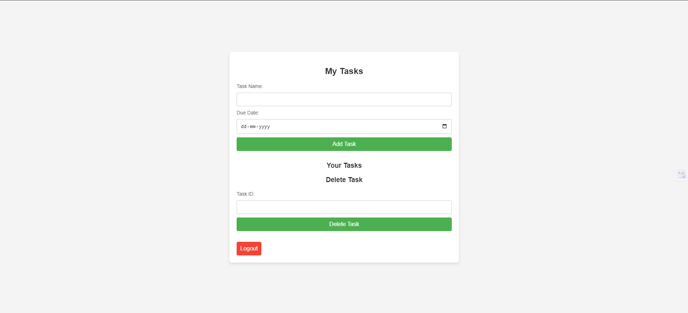
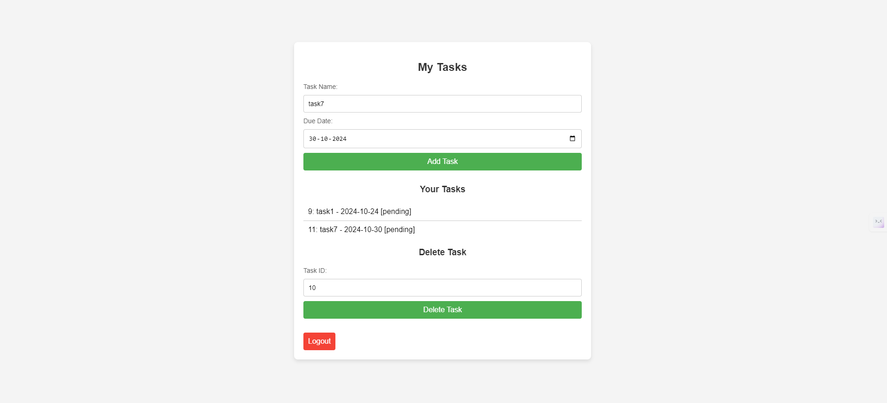
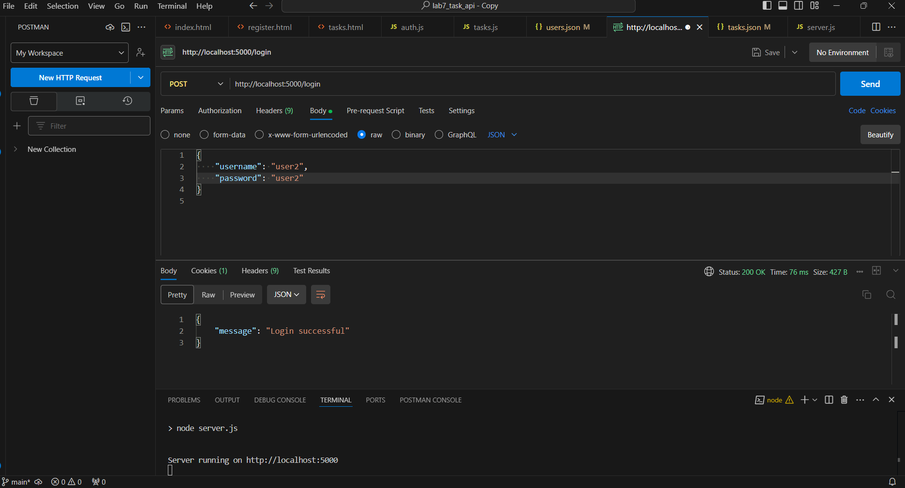
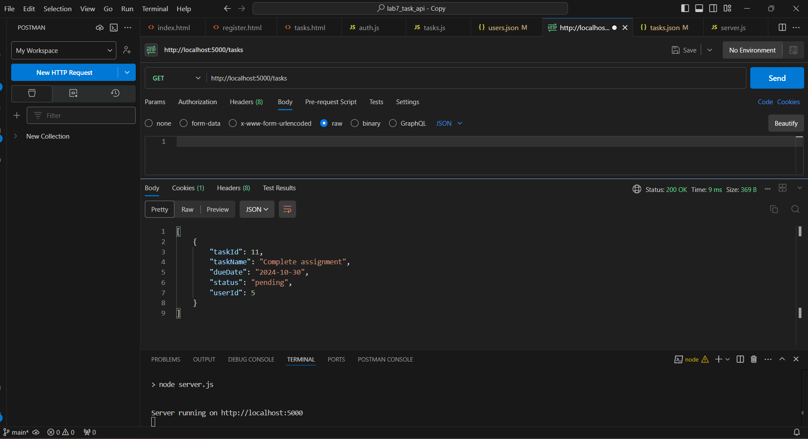
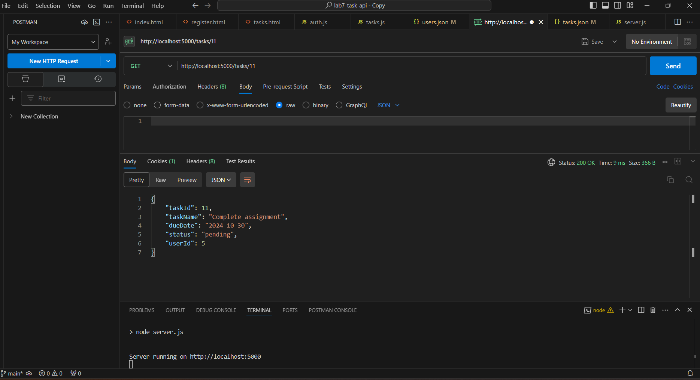
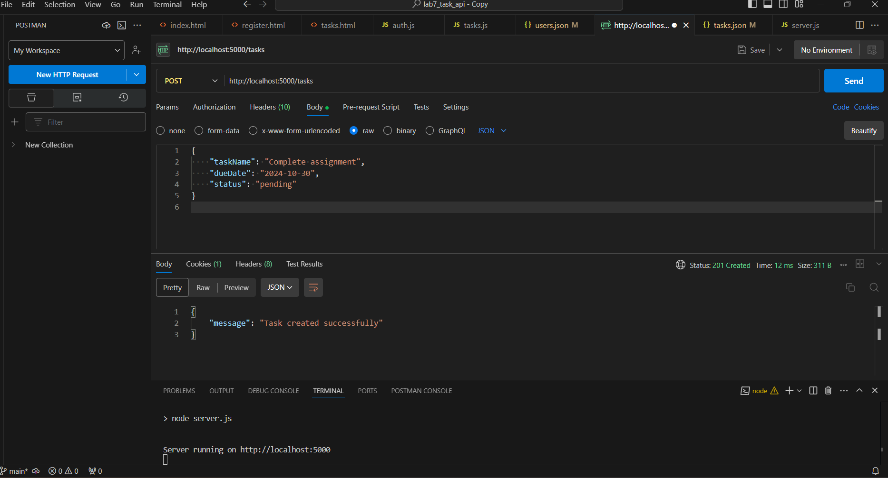
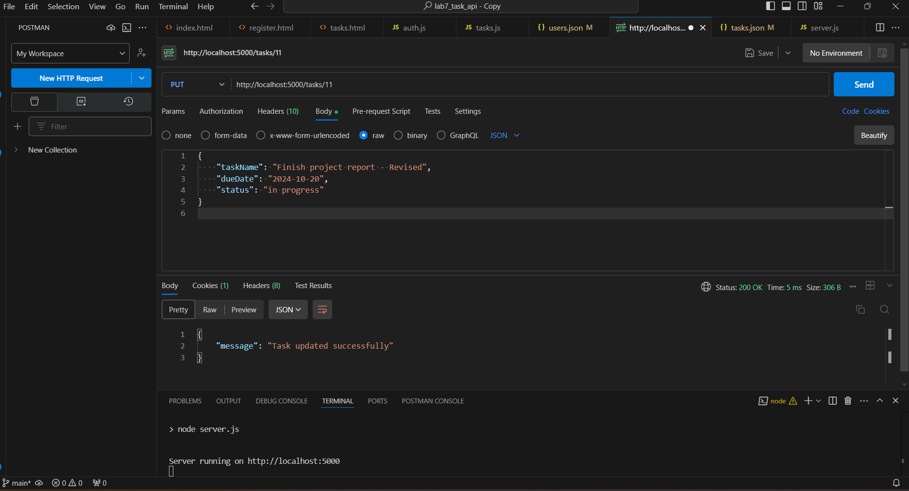

# Task Manager API

## Overview
The **Task Manager API** is a Node.js application that allows users to manage their tasks efficiently. Users can register, log in, and perform CRUD operations on their tasks through a simple RESTful API. The API utilizes Express.js for routing and bcrypt.js for secure password hashing.

## Features
- User registration and authentication
- Task creation, retrieval, updating, and deletion
- Secure password handling with bcrypt.js
- Data stored in JSON files

## Technologies Used
- **Node.js**: JavaScript runtime for server-side programming
- **Express.js**: Web framework for building the API
- **bcrypt.js**: Library for hashing passwords
- **dotenv**: For managing environment variables
- **CORS**: To allow cross-origin requests
- **Morgan**: HTTP request logger
- **Nodemon**: Development tool for automatically restarting the server

## File Structure
```
task-manager-api/
├── .env
├── package.json
├── server.js
├── data/
│   ├── users.json
│   └── tasks.json
├── routes/
│   ├── auth.js
│   └── tasks.js
├── public/
│   ├── index.html
│   ├── register.html
│   └── tasks.html
├── styles.css
```

## Installation
1. Clone the repository:
   ```bash
   git clone https://github.com/yourusername/task-manager-api.git
   cd task-manager-api
   ```

2. Install the dependencies:
   ```bash
   npm install
   ```

3. Create a `.env` file in the root directory with the following content:
   ```
   PORT=5000
   ```

## Usage
1. Start the server:
   ```bash
   npm run dev
   ```

2. The API will be available at `http://localhost:5000`.

## API Endpoints
### User Authentication
- **POST /register**: Register a new user.
- **POST /login**: Authenticate an existing user.

### Task Management
- **POST /tasks**: Create a new task (requires authentication).
- **GET /tasks**: Retrieve all tasks for the authenticated user.
- **GET /tasks/:id**: Retrieve a specific task by ID (requires authentication).
- **PUT /tasks/:id**: Update a task by ID (requires authentication).
- **DELETE /tasks/:id**: Delete a task by ID (requires authentication).
## Screenshots

### Login Page

### Tasks Page



## Testing
You can test the API endpoints using tools like [Postman](https://www.postman.com/) or [curl](https://curl.se/).
### Testing in Postman
#### POST: Register User

#### POST: Login User

#### GET: Get tasks


#### POST: Add task

#### PUT: Update task

#### DELETE: task(task id)


## License
This project is licensed under the MIT License - see the [LICENSE](LICENSE) file for details.

## Author
[Your Name](https://github.com/yourusername)
```

### Notes
- Make sure to replace `https://github.com/yourusername/task-manager-api.git` with your actual GitHub repository link.
- Update the author section with your name and GitHub profile link if desired.
- Feel free to modify any section to better suit your project!
